`## 系统名称 
汽车租赁系统 carRental

### 完整项目获取

通过网盘分享的文件：汽车租赁系统

链接: https://pan.baidu.com/s/1AahGxuVYXIsjlMHGVpEd0w?pwd=5u4w 提取码: 5u4w
--来自百度网盘超级会员v3的分享

### 项目合集(项目不断更新中，包含java、vue、python、Android、微信小程序等项目)

链接: https://pan.baidu.com/s/1nY-zhvAK0CXYcn3g7LzQnQ?pwd=id3c 提取码: id3c
--来自百度网盘超级会员v3的分享

### 工具包

链接: https://pan.baidu.com/s/1YmdoJvkjoUjA75wvHLDZ6A?pwd=xm96 提取码: xm96
--来自百度网盘超级会员v3的分享

需要远程项目部署或项目修改和毕业设计也可联系（添加申请时请备注好来意）

### 远程调试部署联系方式

链接: https://pan.baidu.com/s/1W0dDcoZmayG0c7USJDYBYg?pwd=nqd7 提取码: nqd7
--来自百度网盘超级会员v3的分享

#### 这些项目一起发你了 可以分享给你需要的同学 调试可找我 也接二次修改和项目定制、毕业设计等

## 接毕业设计和论文

微信联系方式：xzxj0206  QQ：3808981644   (支持修改、 部署调试、 支持代做毕设)

接网站建设、小程序、H5、APP、各种系统等，单片机、嵌入式也可以做

选题+开题报告+任务书+程序定制+安装调试+论文+答辩ppt  都可以做

### 系统概要
汽车租赁系统总共分为两个大的模块，分别是系统模块和业务模块。其中系统模块和业务模块底下又有其子模块。
### 功能模块
#### 一、业务模块
##### 1、客户管理
###### 客户列表
###### 客户分页和模糊查询
###### 客户添加、修改、删除
###### 导出客户数据
##### 2、车辆管理
###### 车辆列表
###### 车辆车辆分页和模糊查询
###### 车辆添加、修改、删除
##### 3、业务管理
###### 汽车出租
1、根据客户身份证查询所有未出租的车辆信息  
2、进行出租
###### 出租单管理
1、多条件的模糊查询和分页  
2、出租单的修改、删除、导出
###### 汽车入库
###### 检查单管理
1、多条件模糊查询和分页  
2、检查单修改  
3、导出检查单
##### 4、统计分析
###### 客户男女比例图
###### 月出租量统计
###### 销售员业绩统计
###### 出租车辆类型统计
#### 二、系统模块
##### 1、用户登陆
###### 校验用户名和密码
###### 登陆成功将登陆信息写入登陆日志
###### 未登录进行拦截
##### 2、菜单管理
###### 全查询菜单和根据左边的树查询不同菜单
###### 菜单的添加、修改、删除
##### 3、角色管理
###### 全查询角色和模糊查询
###### 角色的添加、修改、删除
##### 4、用户管理
###### 全查询用户和模糊查询
###### 用户的添加、修改、删除以及重置密码
##### 5、数据源的监控(druid monitor)

### 技术选型
#### 后台技术选型
* Spring
* SpringMVC
* Mybatis
#### 前端技术选型
* LayUI、dtree、echarts

`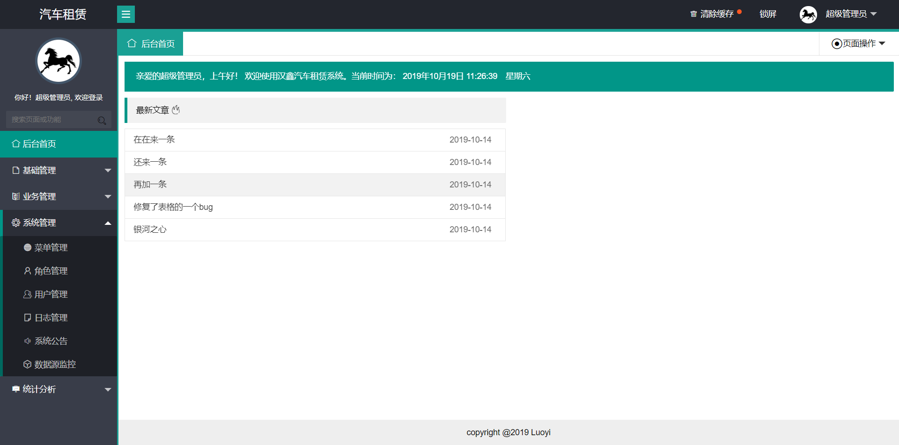

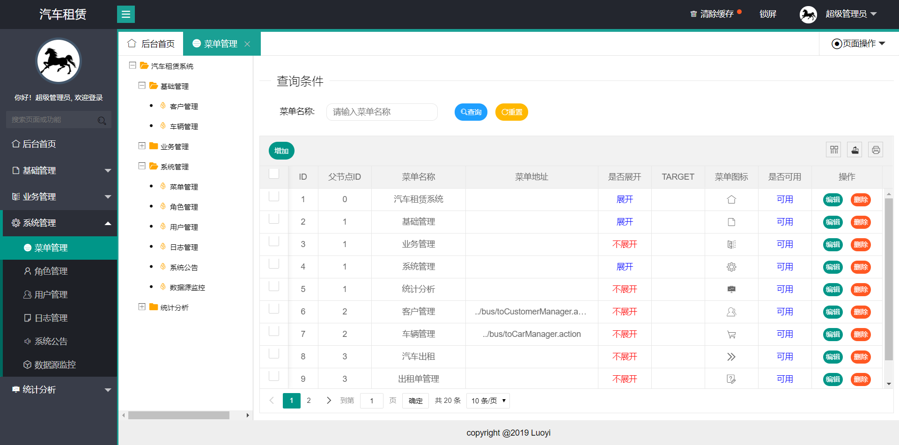

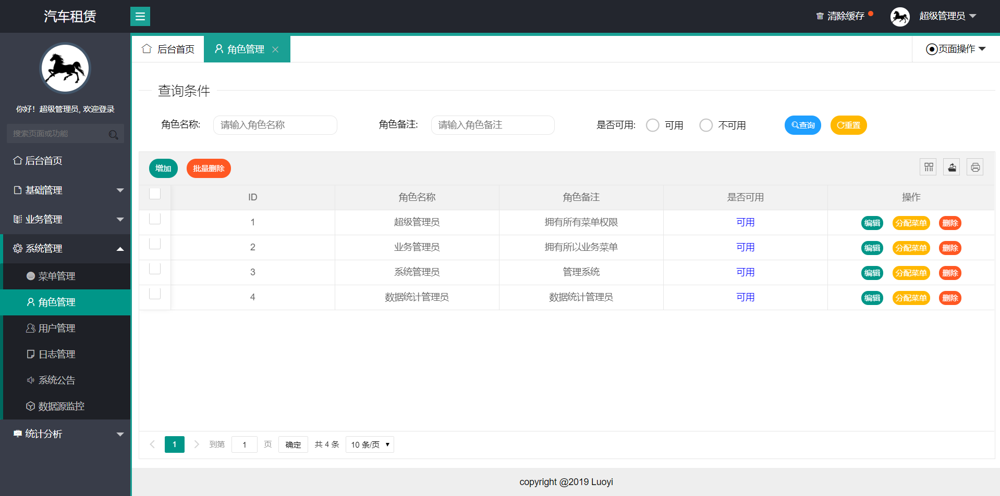

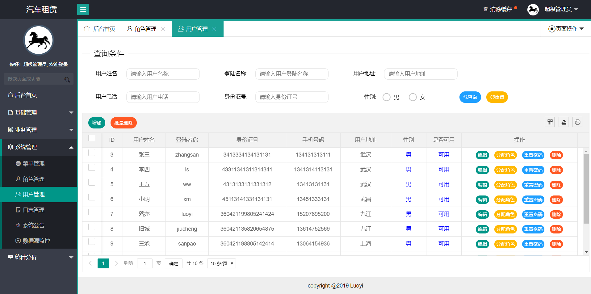

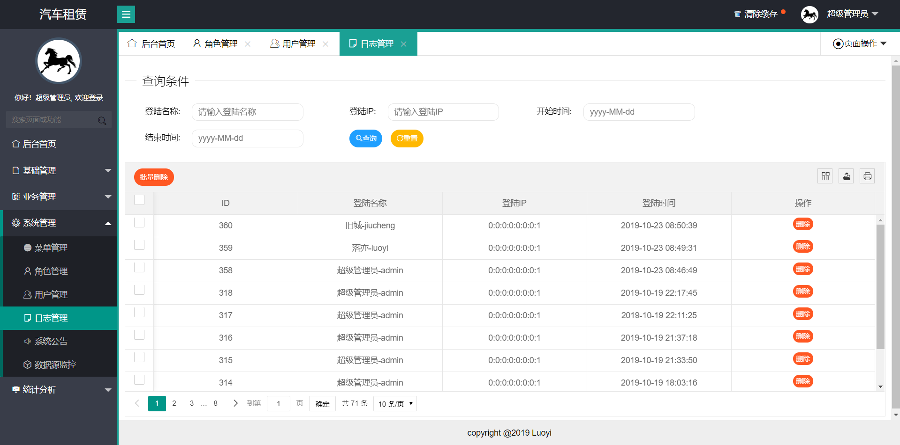

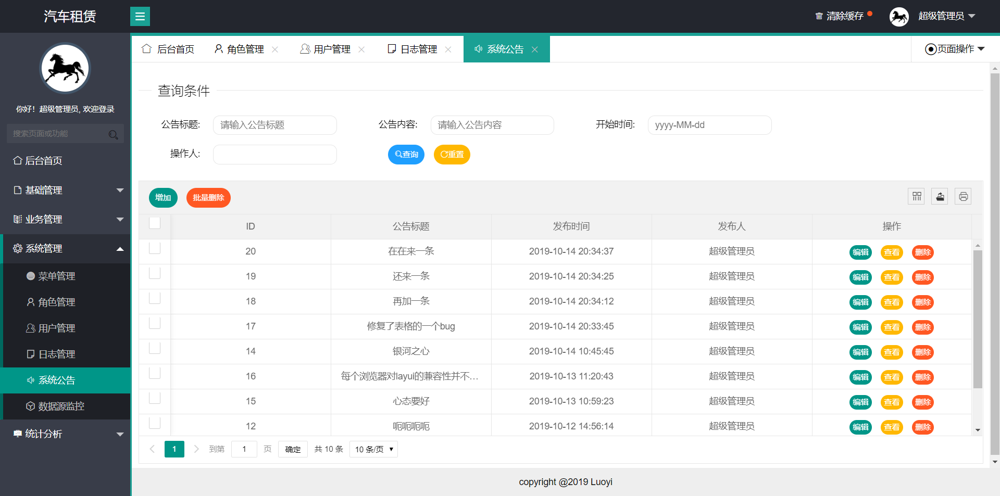

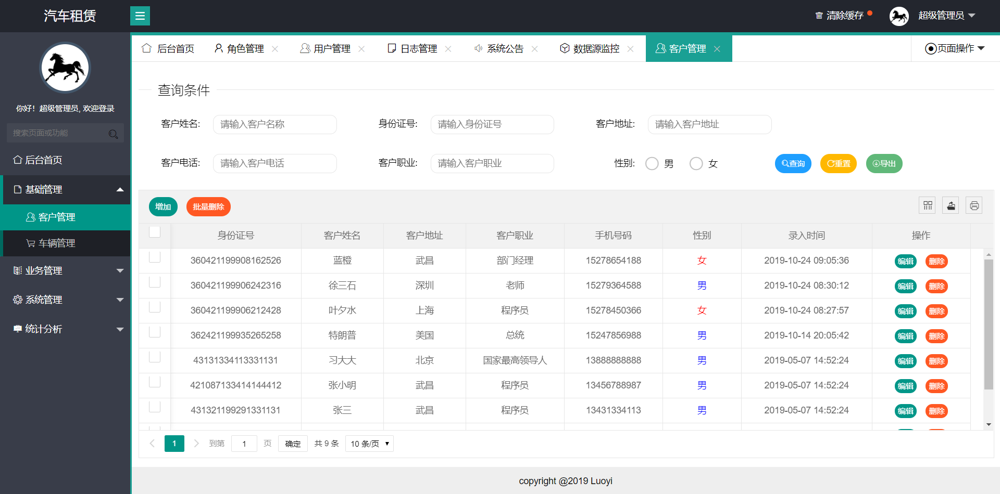

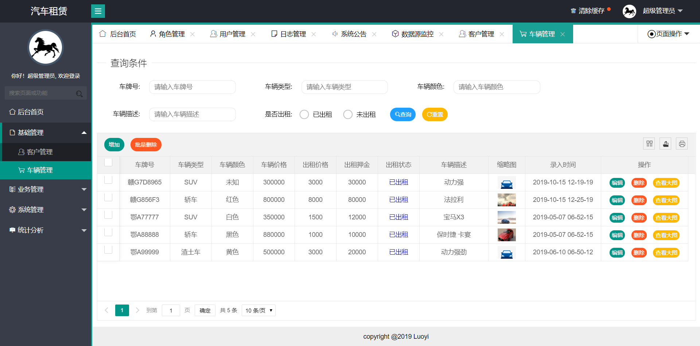

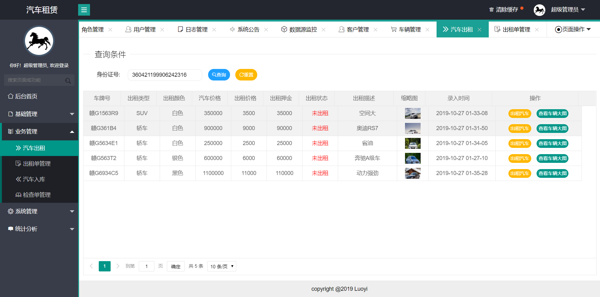

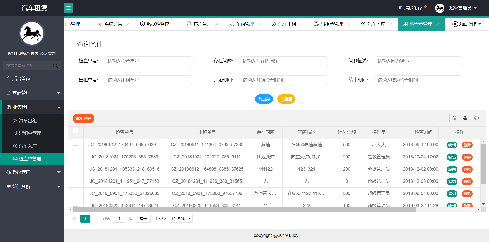

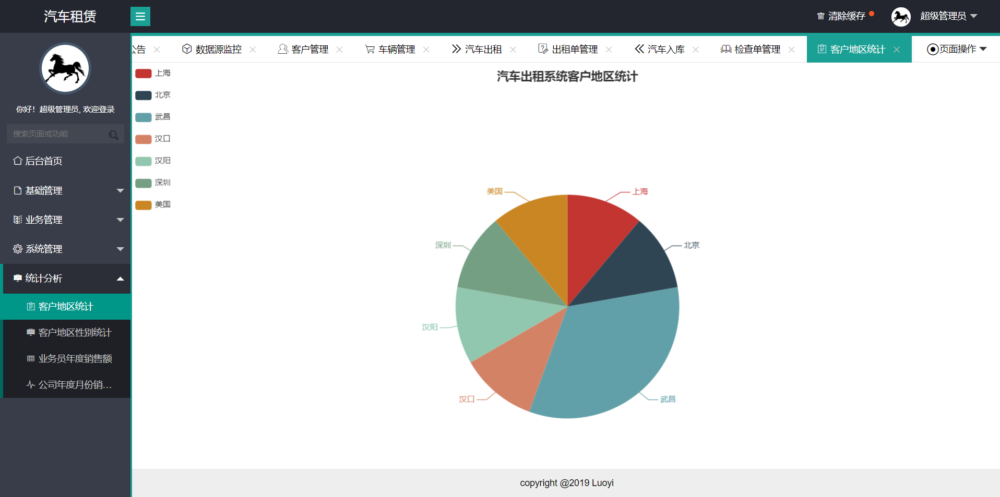

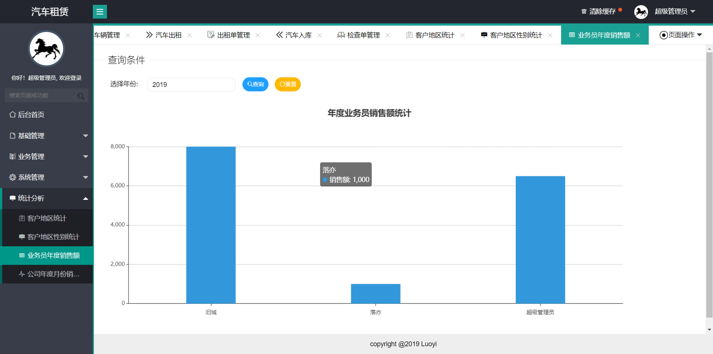

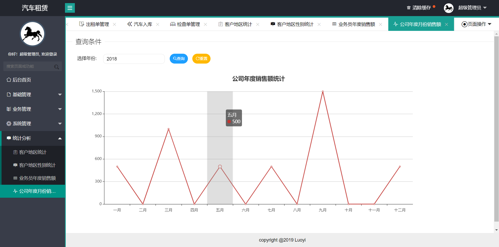

